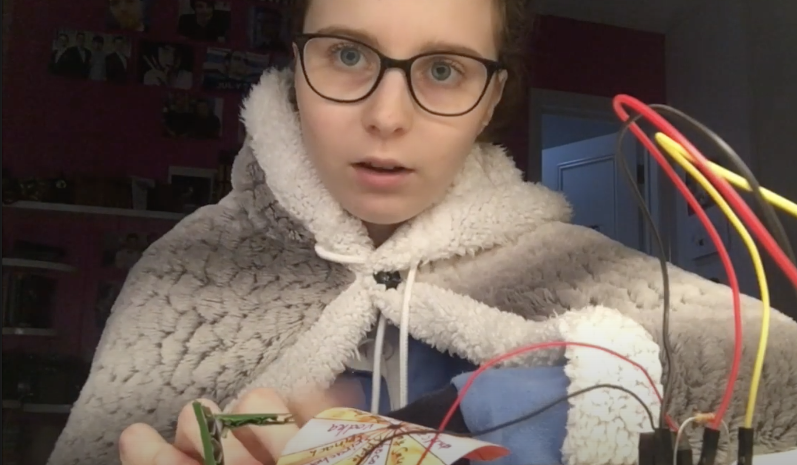
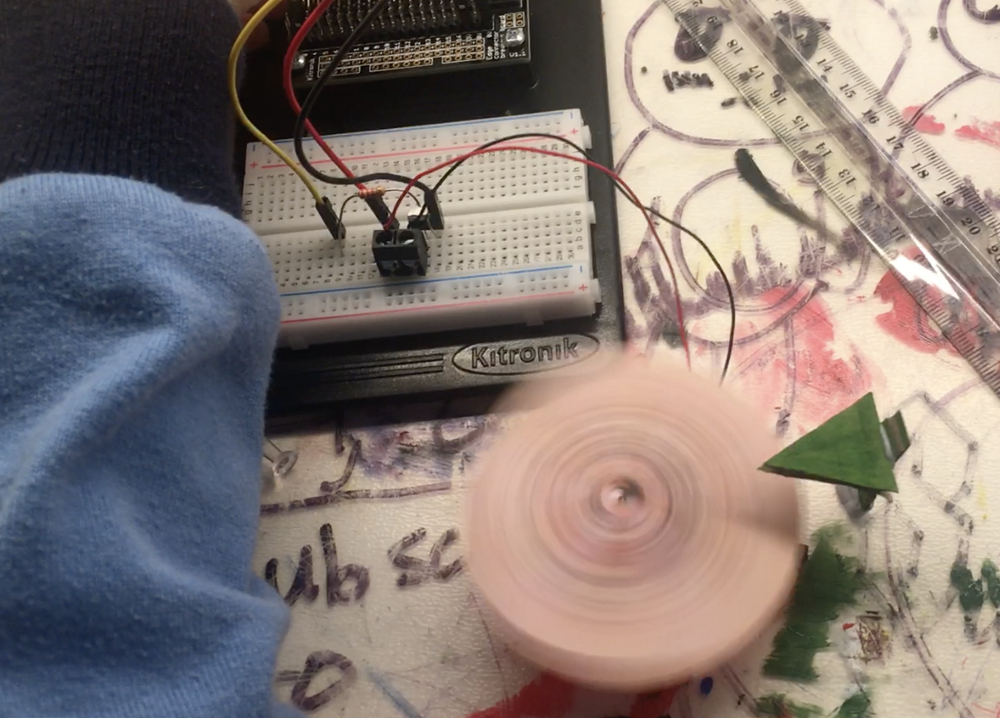
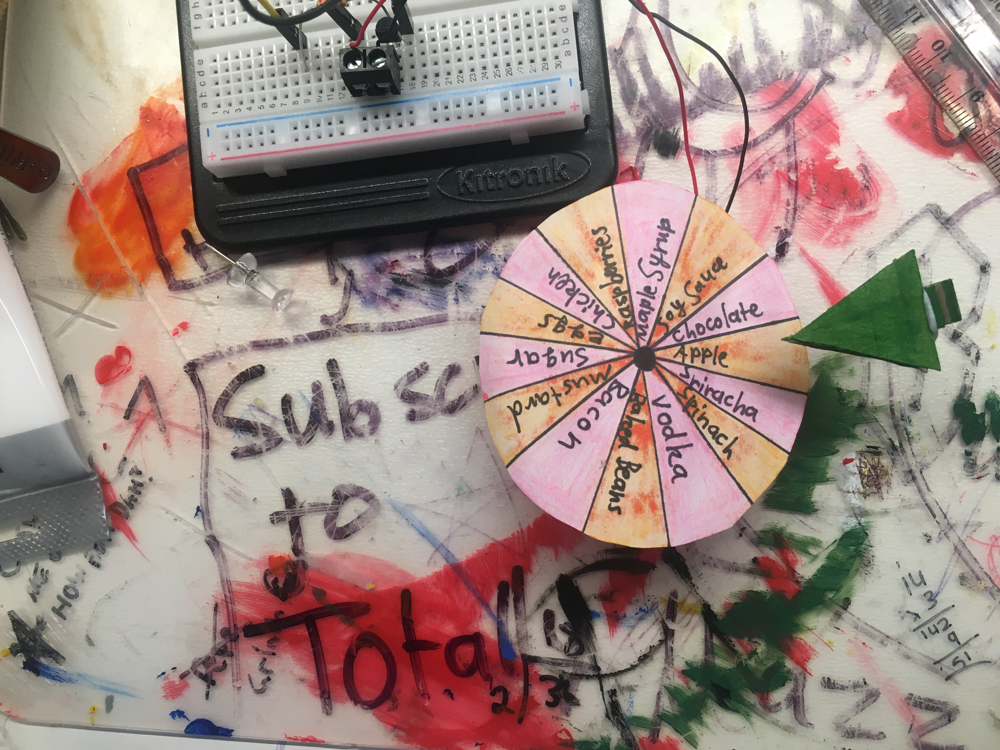

# *Lucky Ingredient Wheel*
## *Mary-Claire Power* ##
## 1701QCA Making Interaction 2020 Final Project ##

## Project Description ##

*This project is a lucky wheel that is designed for selecting an option from various ingredients. When you press the button on the microbit, it will spin for a random period of time between 1 - 2.5 seconds and then the arrow lands on a random ingredient. This project is designed for anybody, as it could be used as a fun game or challenge during quarantine.* 

## Project Video ##

(https://www.youtube.com/watch?v=jFQsqFjhOlY)

### Journal ###

[Process and reflection journal](/journal/journal.md)
