# 1701QCA Final project journal: *Mary-Claire Power*

### *Magic Button Trick* ###

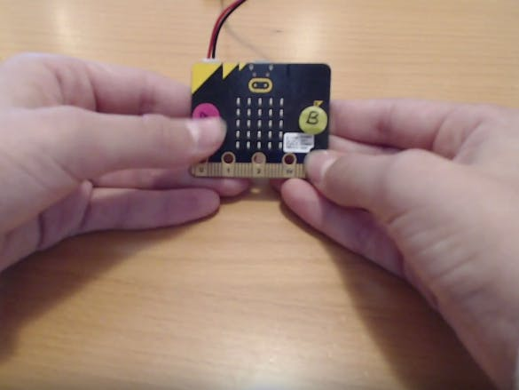

https://makecode.microbit.org/projects/magic-button-trick

*This project is related to mine because it is also a game that involves the microbit button. This game could also be good fun during the quarantine period, just like how my project is aimed at.*

### *Reaction Time* ###

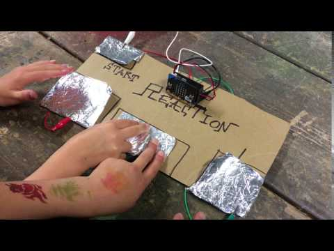

https://makecode.microbit.org/projects/reaction-time

*This project is related to mine because it is also a game that involves a reaction out of the microbit. This game could also be good fun during the quarantine period, just like how my project is aimed at, but it requires a ton of concentration.*

### *7 Seconds Game* ###

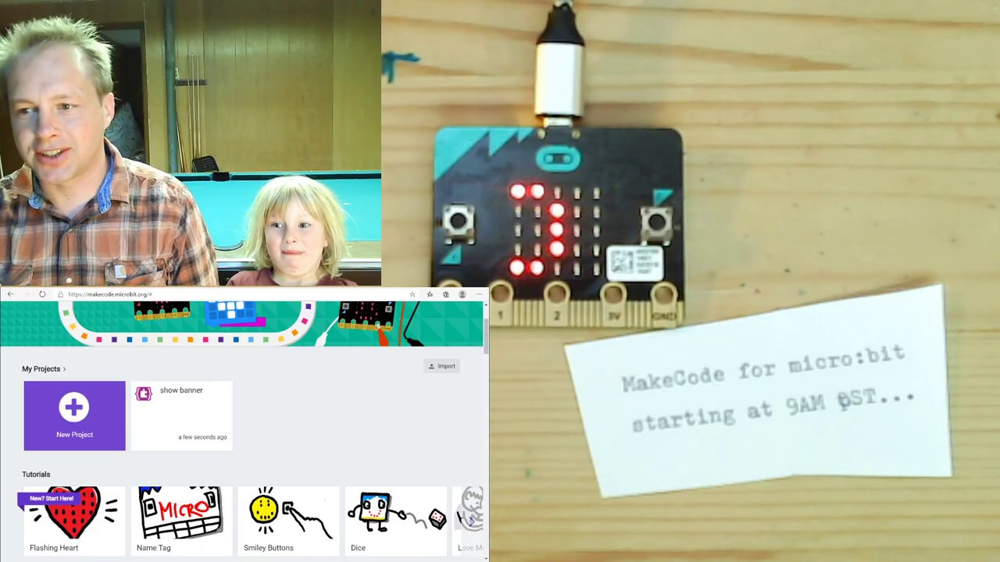

https://makecode.microbit.org/projects/7-seconds

*This project is related to mine because it is also a game that involves the microbit button. This game does require a lot of concentration and patience, but it still could be fun to play.*

### *Rock Paper Scissors* ###

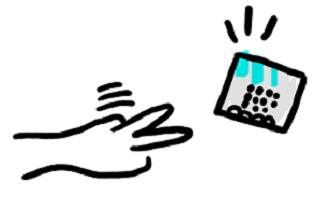

https://makecode.microbit.org/projects/rock-paper-scissors

*This project is related to mine because it is also a fun game. However, it doesn't involve the microbit button but this game could also be good fun during the quarantine period, just like how my project is aimed at.*

### *Coin Flipper* ###

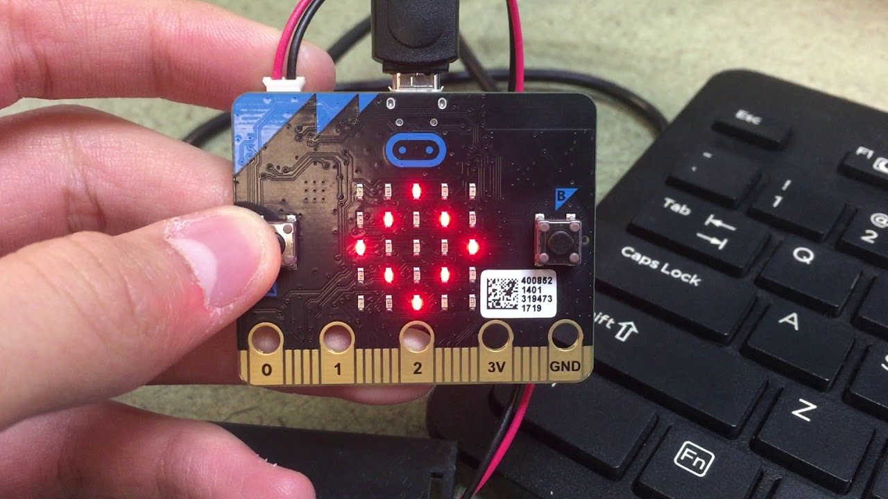

https://makecode.microbit.org/projects/coin-flipper

*This project is related to mine because it is also a fun game that involves the microbit. It may not use the button but it's still a fun interactive game that involves friends or family.*

### *Heads Guess* ###

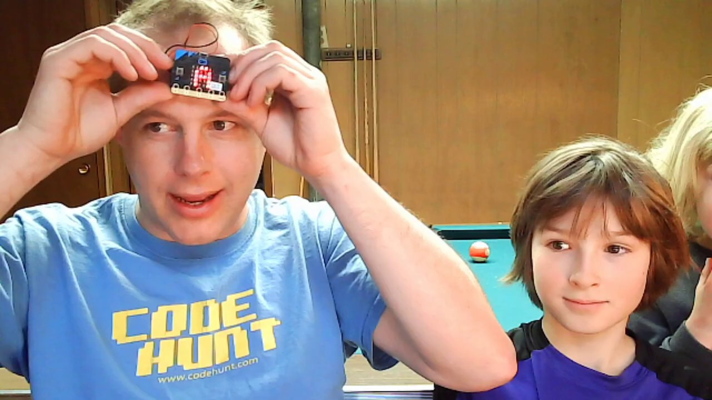

https://makecode.microbit.org/projects/heads-guess

*This project is related to mine because it is also a fun game that involves the microbit. It may not involve the button but it can still be used to bond with friends and family.*

## Conceptual development ##

### Design intent ###

*A machine that randomly selects ingredients for you, so you could turn into a fun food challenge/game.*

### Design ideation ###

*1. Randomly pick ingredients at home, then list them and make a random list generator.* 

*2. Make something that shoots a random word at you.* 

*3. Pick a randomised number, and match the number to an ingredient.* 

### Final design concept ###

*The final design concept (the one that I will actually be using throughout this project) is to have the machine pick a random, different ingredient each time through the use of a Lucky/Spinning Wheel. This idea was inspired by TV shows such as Masterchef and Wheel of Fortune. I am planning to make a cardboard wheel with a variety of ingredients and then attach it to a motor. I am also going to make an arrow as well and then program the motor so that the arrow lands on a different ingredient each time. The speed of the motor will be controlled by far the buttons on the actual microbit are pushed and for how long.*

### Interaction flowchart ###

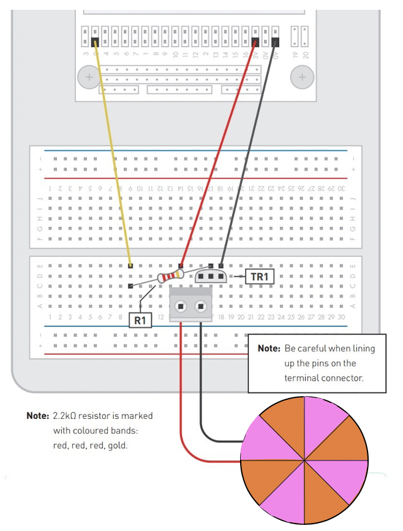

## Process documentation ##

## Materials Used ##

- Paper
- Colouring Pencils
- Textas
- Microbit
- Breadboard
- Motor
- Bluetack
- Transistor
- 2.2kΩ Resistor
- M/F Jumper Wires

## Code Samples ##

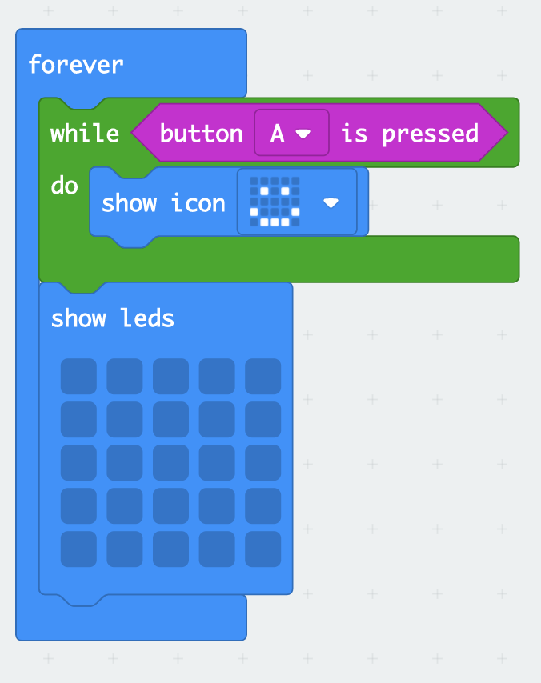

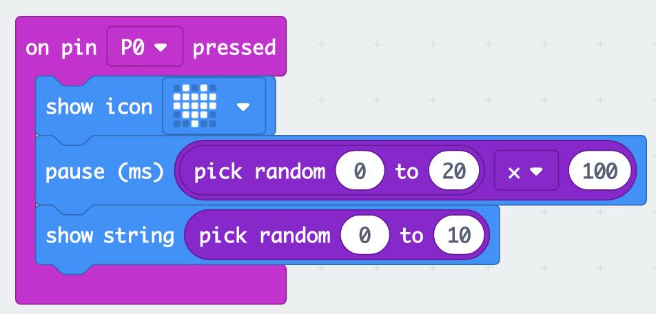

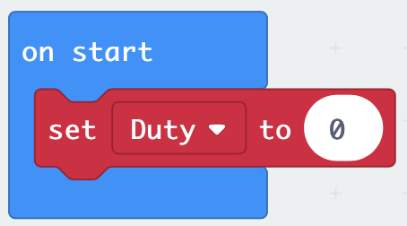

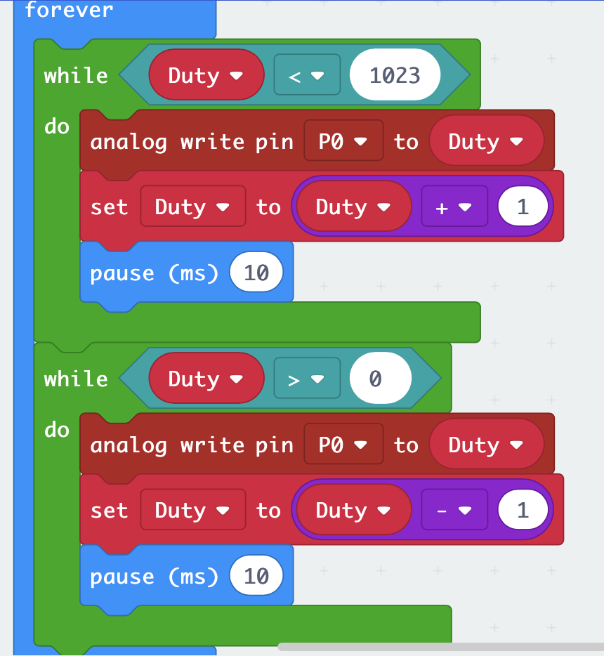

## Inspiration Images ##

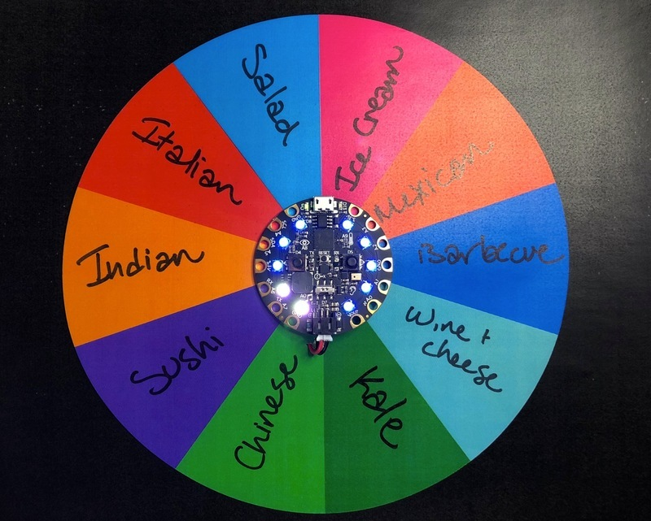

*Idea behind the wheel...*

## Final code ##

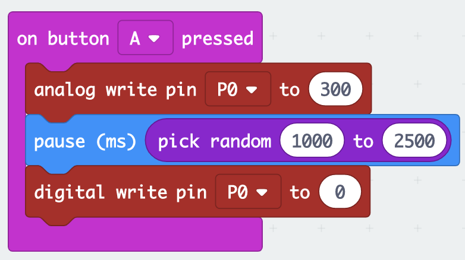

## Design process discussion ##

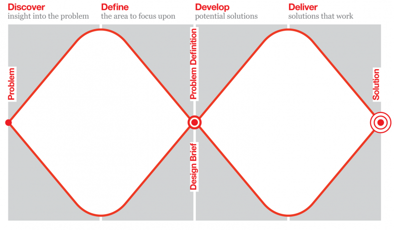

*Discover:* I had to discover ways to achieve my idea of making a fun game involving a random picking of ingredients. I really struggled to think of many different ways to achieve this idea.

*Define:* I had to really think of how to design the list or the type of machine that would pick the ingredients, and i had to picture different solutions in my head.

*Develop:* I ended up talking one-on-one with my tutor, Ged as I was really stuck to come up with solutions. He gave me the idea of a spinning wheel and arrow that is attached to a motor, and depending on how long the wheel spins for, it could give me different ingredients each time. He was talking about Masterchef, so I took that as another inspiration. He also helped me to come up with the final code, so that gave me a lot to work with. 

*Deliever:* I ended up having a working code and a design that worked for this idea. So I was confident and ready to start finishing this project.

## Reflection ##

*Things I have found useful from other sources include the use of the microbit buttons, the idea of a game, and the idea of using the motor.*

*The main part that i feel is novel is the actual wheel itself. I had originally made it out of cardboard and acryll paint however, when I attached it to the motor with quite a bit of blue-tack, i found that it wasn't spinning as there was so much weight on it. So I ended up making the wheel out of paper, textas, and colouring pencils, and I used less blue-tack. I found out that it helped more as paper is lighter than cardboard, so it was able to spin easily.* 

*Another context that this project could be used is that somebody could use this to decide what ingredients they should put in a random meal of the day and make it more interesting, rather than a game or online challenge. Another extension could be that you can add meals instead of ingredients and you have to recreate a randomly-selected meal in a certain timeframe.*
