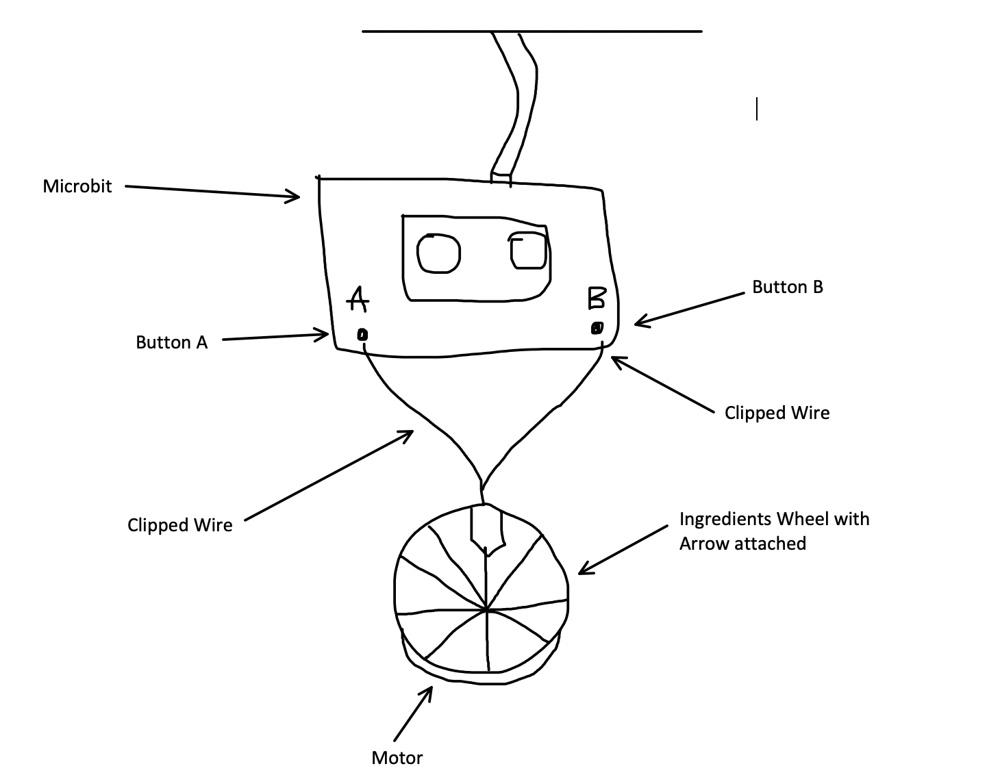

# 1701QCA Final project journal: *Mary-Claire Power*

### *Magic Button Trick* ###

https://makecode.microbit.org/projects/magic-button-trick

*This project is related to mine because it is also a game that involves the microbit button. This game could also be good fun during the quarantine period, just like how my project is aimed at.*

### *Reaction Time* ###

https://makecode.microbit.org/projects/reaction-time

*This project is related to mine because it is also a game that involves a reaction out of the microbit. This game could also be good fun during the quarantine period, just like how my project is aimed at, but it requires a ton of concentration.*

### *7 Seconds Game* ###

https://makecode.microbit.org/projects/7-seconds

*This project is related to mine because it is also a game that involves the microbit button. This game does require a lot of concentration and patience, but it still could be fun to play.*

### *Rock Paper Scissors* ###

https://makecode.microbit.org/projects/rock-paper-scissors

*This project is related to mine because it is also a fun game. However, it doesn't involve the microbit button but this game could also be good fun during the quarantine period, just like how my project is aimed at.*

### *Coin Flipper* ###

https://makecode.microbit.org/projects/coin-flipper

*This project is related to mine because it is also a fun game that involves the microbit. It may not use the button but it's still a fun interactive game that involves friends or family.*

### *Heads Guess* ###

https://makecode.microbit.org/projects/heads-guess

*This project is related to mine because it is also a fun game that involves the microbit. It may not involve the button but it can still be used to bond with friends and family.*

## Conceptual development ##

### Design intent ###

*A machine that randomly selects ingredients for you, so you could turn into a fun food challenge/game.*

### Design ideation ###

*1. Randomly pick ingredients at home, then list them and make a random list generator.* 

*2. Make something that shoots a random word at you.* 

*3. Pick a randomised number, and match the number to an ingredient.* 

### Final design concept ###

*The final descign concept (the one that I will actually be using thorughout this project) is to have the machine pick a random, different ingredient each time throught the use of a Lucky/Spinning Wheel. This idea was inspired by TV shows such as Masterchef and Wheel of Fortune. I am planning to make a cardboard wheel with a variety of ingredients and then attach it to a motor. I am also going to make an arrow as well and then program the motor so that the arrow lands on a different ingredient each time. The speed of the motor will be controlled by far the buttons on the actual microbit are pushed and for how long.*

### Interaction flowchart ###
<!--- Include an interaction flowchart of the interaction process in your project. Make sure you think about all the stages of interaction step-by-step. Also make sure that you consider actions a user might take that aren't what you intend in an ideal use case. Insert an image of it below. It might just be a photo of a hand-drawn sketch, not a carefully drawn digital diagram. It just needs to be legible. --->

## Process documentation ##
<!--- In this section, include text and images (and potentially links to video) that represent the development of your project including sources you've found (URLs and written references), choices you've made, sketches you've done, iterations completed, materials you've investigated, and code samples. Use the markdown reference for help in formatting the material.

This should have quite a lot of information! It will likely include most of the process documentation from assessment 2 which can be copied and pasted here.

Use subheadings to structure this information. See https://guides.github.com/features/mastering-markdown/ for details of how to insert subheadings.

There will likely by a dozen or so images of the project under construction. The images should help explain why you've made the choices you've made as well as what you have done. --->

## Final code ##

<!--- Include here screenshots of the final code you used in the project if it is done with block coding. If you have used javascript, micropython, C, or other code, include it as text formatted as code using a series of three backticks ` before and after the code block. See https://guides.github.com/features/mastering-markdown/ for more information about that formatting. --->

## Design process discussion ##
<!--- Discuss your process used in this project, particularly with reference to aspects of the Double Diamond design methodology or other relevant design process. --->

## Reflection ##

<!--- Describe the parts of your project you felt were most successful and the parts that could have done with improvement, whether in terms of outcome, process, or understanding.

What techniques, approaches, skills, or information did you find useful from other sources (such as the related projects you identified earlier)?

What parts of your project do you feel are novel? This is IMPORTANT to help justify a key component of the assessment rubric.

What might be an interesting extension of this project? In what other contexts might this project be used? --->
